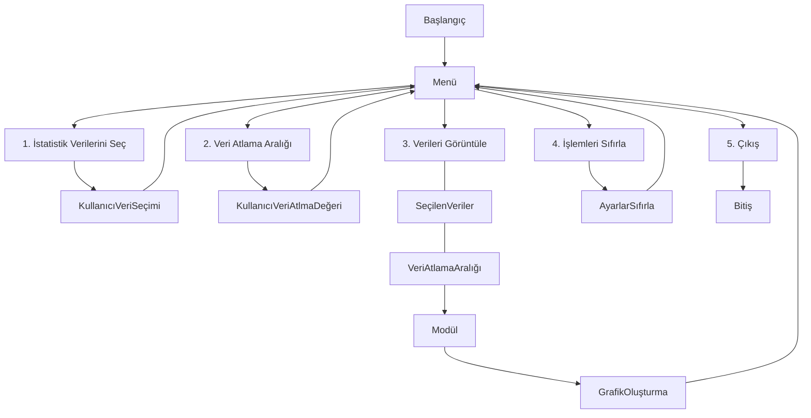
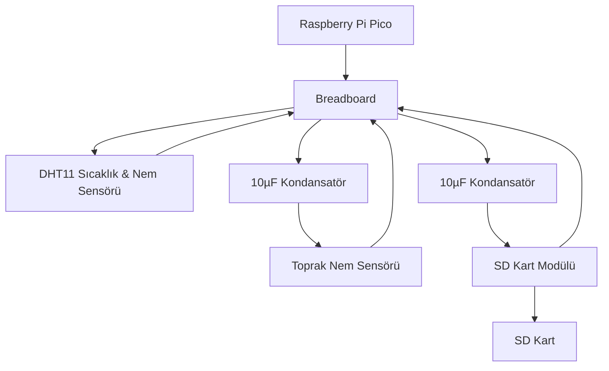
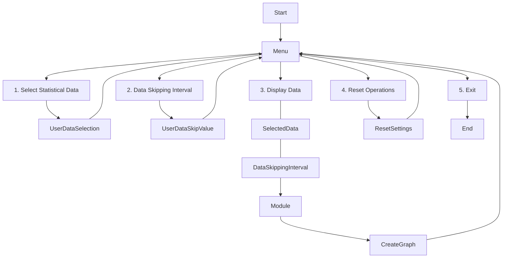
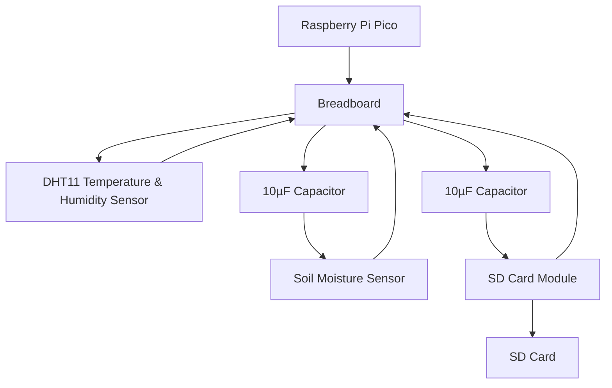

 
# Akıllı Sera Sistemi 

## Proje Hakkında
Akıllı Sera Sistemi, tarım verimliliğini artırmayı hedefleyen bir projedir. Bu proje, tarımsal verilerin işlenmesi ve görselleştirilmesi yoluyla çiftçilere sera yönetiminde yardımcı olur. Proje, kullanıcı dostu bir menü sistemi ve grafiksel analizlerle çalışmaktadır.

---

## Proje Akışı
Aşağıdaki akış diyagramı, projenin görselleştirme yapısını  `Seragrafik.py`özetler:




---
## Devre Sistemi     
Aşağıdaki akış diyagramı, projenin Veri toplama yapısını `seraData.py`özetler:

---

| Kullanılan Malzemeler        | Miktar  | Amaç                                                        |
|-----------------------------|---------|-------------------------------------------------------------|
| Raspberry pi pico (board)   | 1 adet  | Sıcaklık, havanın nem oranı ve toprağın nem oranını işler   |
| Dht11                       | 1 adet  | Sıcaklık ve havanın nem oranı için                          |
| Toprak Nem sensörü          | 1 adet  | Toprağın nem oranını hesaplar                               |
| 10µF kondansatör            | 2 adet  | Devrenin parazit oluşumundan etkilenmemesi için             |
| SD Kart Modülü              | 1 adet  | Dosya kayıt işlemlerinin yapılması için                     |
| SD Kart                     | 1 adet  | Verilerin saklanması ve taşınabilirliği için                |
| Breadboard                  | 1 adet  | Devre elemanlarının lehimsiz olarak bağlanabilmesi için     |
| Jumper kablo                | Yeteri kadar| Devre elemanlarını birbirine bağlamak için                  |                


---

## Görselleştirmenin Çalışma Şekli
Akıllı Sera Sistemi, beş ana işlevden oluşur:

1. **Veri Seçimi**:
    - Kullanıcı, görmek istediği verileri menüden 1. (Görülmek istenen istatistik dataları seç) kısmından Toprak Nem, Hava Nem ve Hava Sıcaklık seçeneklerinden istediklerini seçer

2. **Veri Atlama Aralığı**:
    - Kullanıcı, büyük veri kümelerinde gereksiz detayları azaltmak için menüden 2. (Veri atlama aralığı seçimi) kısmından bir veri atlama aralığı belirleyebilir (örneğin: her 550. veri).
    - Burası örneğin 9000 tane veriden 0 dan başlayarak 500 veri de bir kere veri toplayacak şekilde çalışır yani 18 tane veriyi baz alır


4. **Verilerin Görselleştirilmesi**:
    -Kullanıcı, görselleştirmek istediği verileri menüden 3. (Verileri görüntüle) kısmından Seçilen veriler grafik olarak görselleştirilir ve çiftçilere daha iyi bir analiz sunar.
    
5. **Ayarların Sıfırlanması**:
    - Kullanıcı, menüden 4. (İşlemleri sıfırla) kısmından menüdeki seçimlerini sıfırlayarak baştan başlayabilir.
   
6. **Uygulamyı Kapatma**:
    - Kullanıcı, menüden 5. (Çıkış) kısmından uygulamayı kapatır.

---

## Çiftçiye Hitap Eden Alanlar
- **Veri Analizi**: Çiftçiler, seralarındaki toprak nemi, sıcaklık ve nem gibi önemli parametreleri analiz edebilir.
- **Karar Verme**: Grafikler sayesinde, sulama, havalandırma veya sıcaklık kontrolü gibi kritik kararları daha bilinçli bir şekilde alabilirler._(İleride makine öğrenmesi ile sistem bu kararları otomatik olarak verebilecek.)_
- **Basit Kullanıcı Arayüzü**: Menü tabanlı sistem, tarımsal tecrübeye sahip olmayan kullanıcılar için bile kolay bir kullanım sağlar.

---

## Kullanılanlar
1. **Çalışma Ortamları**  
    - 🟢 **Spyder**
    - 🟢 **Thonny**

2. **Grafikleştirme Kütüphaneleri**  
    - 📊 **Pandas** —veri işleme kütüphanesi
    - 📊 **Matplotlib** — veri grafikleştirme kütüphanesi

3. **Veri toplamak için gömülü yazılım kütüphaneleri**  
    - ⚙️ **machine**: Mikrodenetleyici donanımını kontrol eder.
    - 💾 **sdcard**: SD kart üzerinden veri okunması ve işlenmesi için kullanılır.
    - ⏱️ **time**: Zaman ayarlamak ve zaman hesaplamaları yapmak için kullanılır.
    - 🗂️ **uos**: SD kart gibi harici depolama birimlerine bağlanmak ve dosya işlemleri gerçekleştirmek için kullanılır.
    - 🌡️ **dht**: DHT11 Sensöründen sıcaklık ve nem değerlerini okur.

4. **Hata Takip Mekanizmaları**:
    Kodda kullanıcı hatalarını ve beklenmedik durumları yakalamak için try/except blokları kullanılmıştır. Bu sayede, kullanıcıdan beklenmeyen bir giriş geldiğinde veya veri okunurken hata oluştuğunda program kullanıcıya bilgilendirici bir mesaj verir ve güvenli şekilde devam eder.

    **Grafik Kısmı İçin:**
    ```python
    try:
       #Main kodları
    except ValueError:#hatalı seçim için
        print("Hatalı giriş yaptınız, lütfen bir sayı girin!"),
    except Exception as hata:# genel hata kontrolü için
        print(f"Bir hata oluştu: {hata}")
    ```
    **Gömülü yazılım İçin:**
    ```python

    try:
	    #SD kart bağlantı kontrolü
	except Exception as e:#İşletim sistemi hata kontrolü
        print(f"SD kart bulunamadı:{e}")
    try:
	    #dosya kontrolü
	except OSError as hata:#İşletim sistemi hata kontrolü
        print(f"Bir hata oluştu: {hata}")
    try:
       #Main kodları
     except ValueError:#hatalı girdi seçimi kontrolü
        print("Hatalı giriş yaptınız, lütfen bir sayı girin!")
    except KeyError as e:#Veri sütun hata kontrolü
        print(f"Veri sütunu bulunamadı: {e}")
    except Exception as hata:# genel hata kontrolü 
        print(f"Bir hata oluştu: {hata}")
    ```

5. **Kurulum**
    ```bash
    git clone https://github.com/mrdedektif/Greenhouse-statistics.git
    ```

8. **Kullanım**:
     - Verilerin Raspberry Pi Pico ile toplanarak `data.csv` veri setinin oluşturulması:
	      ```bash     
       seraData.py
	     ```
    - Alınan dataların grafikleştirilmesi:
      ```bash
      Seragrafik.py
      ```

---

## Lisans
Bu proje MIT Lisansı ile lisanslanmıştır. Daha fazla bilgi için `LICENSE` dosyasını inceleyin.

---

## Gelecekteki Geliştirme Alanları
Bu proje şu alanlarda geliştirilebilir:
- **Mobil Entegrasyon**:
    - Mobil uygulamalarla entegrasyon sağlanarak, çiftçiler akıllı telefonlarından analizlere erişebilecekler.
- **Makine Öğrenimi**:
    - Gelecekte, makine öğrenimi algoritmaları ile veri tahminleri (sıcaklık, nem ve sulama aralıkları değişiklikleri) yapılacaktır.
- **Uyarı Sistemi**:
    - Kritik durumlarda (örneğin, toprak nemi çok düşük olduğunda) çiftçilere SMS yoluyla uyarılar gönderilebilir.
- **Bulut Entegrasyonu**:
    - Veriler bulut üzerinde depolanarak daha geniş bir analiz platformu oluşturulabilir.
---

# Smart Greenhouse System

## About the Project
The Smart Greenhouse System is a project aimed at increasing agricultural productivity. This project assists farmers in greenhouse management by processing and visualizing agricultural data. The project operates with a user-friendly menu system and graphical analyses.

---

## Project Flow
The following flowchart summarizes the visualization structure of the project in `Seragrafik.py`:



---
## Circuit System     
The following diagram summarizes the data collection structure of the project in `seraData.py`:

---

| Components Used             | Quantity  | Purpose                                                  |
|-----------------------------|-----------|----------------------------------------------------------|
| Raspberry Pi Pico (board)   | 1         | Processes temperature, air humidity, and soil moisture   |
| DHT11                       | 1         | For temperature and air humidity                         |
| Soil Moisture Sensor        | 1         | Calculates soil moisture                                 |
| 10µF Capacitor              | 2         | Prevents interference in the circuit                     |
| SD Card Module              | 1         | For file saving operations                               |
| SD Card                     | 1         | For storing and transporting data                        |
| Breadboard                  | 1         | For solderless connection of circuit elements            |
| Jumper Cable                | Sufficient| To connect circuit elements                              |

---

## Visualization Functionality
The Smart Greenhouse System consists of five main functions:

1. **Data Selection**:
    - The user selects which data to view from the menu's 1st option (Select statistical data to visualize): Soil Moisture, Air Humidity, and Air Temperature.

2. **Data Skipping Interval**:
    - The user can set a data skipping interval from the 2nd menu option to reduce unnecessary details in large data sets (e.g., every 550th data point).
    - For example, if there are 9000 records, it will take one data point every 500 records starting from 0, essentially using 18 data points for the analysis.

3. **Data Visualization**:
    - The user visualizes the selected data as graphs from the 3rd menu option (Display Data), providing better analysis for farmers.

4. **Resetting Settings**:
    - The user can reset their menu selections and start over from the 4th menu option (Reset Operations).

5. **Closing the Application**:
    - The user closes the application from the 5th menu option (Exit).

---

## Farmer-Oriented Features
- **Data Analysis**: Farmers can analyze important parameters such as soil moisture, temperature, and humidity in their greenhouses.
- **Decision Making**: With the help of graphs, they can make more informed decisions about irrigation, ventilation, or temperature control. _(In the future, the system will be able to make these decisions automatically using machine learning.)_
- **Simple User Interface**: The menu-based system ensures easy use even for users without agricultural experience.

---

## Technologies Used
1. **Development Environments**  
    - 🟢 **Spyder**
    - 🟢 **Thonny**

2. **Visualization Libraries**  
    - 📊 **Pandas** — a powerful Python library for data processing and analysis
    - 📊 **Matplotlib** — data visualization library

3. **Embedded Software Libraries (for data collection)**  
    - ⚙️ **machine**: Controls microcontroller hardware.
    - 💾 **sdcard**: Used for reading and processing data from SD cards.
    - ⏱️ **time**: Used for setting and calculating time.
    - 🗂️ **uos**: Used to access external storage units like SD cards and perform file operations.
    - 🌡️ **dht**: Reads temperature and humidity values from the DHT11 sensor.

4. **Error Handling Mechanisms**:
    Try/except blocks are used in the code to catch user errors and unexpected situations. This way, if an unexpected input is received from the user or an error occurs while reading data, the program informs the user and continues safely.

    **For the Graph Section:**
    ```python
    try:
       # Main code
    except ValueError: # for invalid selection
        print("Invalid input, please enter a number!")
    except Exception as error: # for general error handling
        print(f"An error occurred: {error}")
    ```
    **For Embedded Software:**
    ```python
    try:
        # SD card connection check
    except Exception as e: # Operating system error handling
        print(f"SD card not found: {e}")
    try:
        # File check
    except OSError as error: # Operating system error handling
        print(f"An error occurred: {error}")
    try:
       # Main code
    except ValueError: # for invalid input selection
        print("Invalid input, please enter a number!")
    except KeyError as e: # Data column error handling
        print(f"Data column not found: {e}")
    except Exception as error: # general error handling
        print(f"An error occurred: {error}")
    ```

5. **Setup**
    ```bash
    git clone https://github.com/mrdedektif/Greenhouse-statistics.git
    ```

6. **Usage**:
     - Creating the `data.csv` dataset by collecting data with Raspberry Pi Pico:
	      ```bash     
          seraData.py
	      ```
    - Visualizing the collected data:
      ```bash
      Seragrafik.py
      ```

---

## License
This project is licensed under the MIT License. For more information, see the `LICENSE` file.

---

## Future Development Areas
This project can be expanded in the following areas:
- **Mobile Integration**:
    - By integrating with mobile applications, farmers will be able to access analyses from their smartphones.
- **Machine Learning**:
    - In the future, machine learning algorithms will be used for data predictions (temperature, humidity, and irrigation interval changes).
- **Alert System**:
    - In critical situations (e.g., when soil moisture is too low), alerts can be sent to farmers via SMS.
- **Cloud Integration**:
    - By storing the data in the cloud, a broader analysis platform can be provided.

---
- **GitHub :** [@mrdedektif](https://github.com/mrdedektif)
